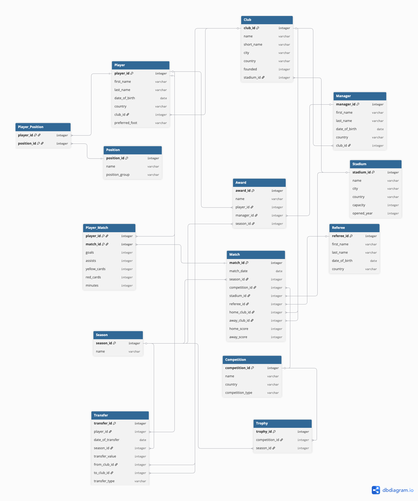

# Arsenal Club Database

## Overview

The Arsenal Club Database is a PostgreSQL relational database project created as part of the Codecademy Full-Stack Engineer Career Path.

The database models key aspects of a professional football club, including clubs, players, managers, matches, transfers, competitions, trophies and awards. It demonstrates the design and implementation of a fully normalised relational database, complete with realistic seed data and a collection of SQL queries showcasing common database operations.

This project was designed to reinforce core SQL concepts including table relationships, primary and foreign keys, joins, aggregate functions and data filtering.

## Features

- Designed and implemented a fully normalised relational database using PostgreSQL.
- Created 13 interconnected tables using primary and foreign key relationships.
- Populated the database with realistic football-related seed data, including clubs, players, managers, matches, transfers and awards.
- Wrote a collection of SQL queries demonstrating filtering, sorting, joins, aggregate functions and conditional logic.
- Applied database normalisation principles to reduce redundancy and maintain data integrity.
- Modelled many-to-many relationships using junction tables.

## Database Schema

The database consists of 13 relational tables representing key aspects of a professional football club, including clubs, players, managers, matches, competitions, transfers and awards.

The schema was designed using normalisation principles to minimise redundancy while maintaining data integrity through primary and foreign key relationships. Junction tables are used to model many-to-many relationships between players and positions, and players and matches.

An Entity Relationship Diagram (ERD) is included in this repository to illustrate the database structure and relationships.

## Entity Relationship Diagram

The Entity Relationship Diagram (ERD) provides a visual representation of the database schema, illustrating the relationships between each table and how data is connected throughout the database.



## Technologies Used

- **PostgreSQL** – Relational database management system used to create and manage the database.
- **Postbird** – PostgreSQL client used to execute SQL scripts and queries.
- **SQL** – Used to define the database schema, populate tables with seed data and query the database.
- **dbdiagram.io** – Used to design the Entity Relationship Diagram (ERD) and plan the database structure.
- **Git** – Version control used throughout development.
- **GitHub** – Repository hosting and project documentation.

## Installation

1. Clone the repository:

```bash
git clone https://github.com/SamMeade24//arsenal-club-database.git
```

2. Navigate to the project directory:

```bash
cd arsenal-club-database
```

3. Create a PostgreSQL database.

4. Execute the `schema.sql` script to create the tables and populate the database with seed data.

5. Run the queries in `queries.sql` to explore and analyse the database.
```

## Example Queries

The project includes a collection of SQL queries demonstrating a range of database concepts, including joins, aggregate functions, filtering and conditional logic.

Some example queries include:

- Listing every club alphabetically.
- Displaying match results with home and away clubs using table aliases.
- Displaying player transfers with selling and buying clubs.
- Counting the number of players at each club using `COUNT()` and `GROUP BY`.
- Categorising transfer fees using a `CASE` statement.

For the complete collection of queries, see [`queries.sql`](queries.sql).

## Future Improvements

Potential future enhancements include:

- Expanding the database to include additional historical seasons and player statistics.
- Adding support for European competitions such as the UEFA Champions League and Europa League.
- Recording detailed match events, including substitutions, bookings and goalscorers.
- Creating SQL views and stored procedures to simplify common reporting tasks.
- Developing a front-end application to visualise and interact with the database.

## Learning Outcomes

This project provided practical experience in designing and implementing a relational database using PostgreSQL. Throughout development, I strengthened my understanding of:

- Relational database design and normalisation.
- Primary and foreign key relationships.
- Creating and populating database tables with realistic seed data.
- Writing SQL queries using joins, aggregate functions and conditional logic.
- Managing many-to-many relationships using junction tables.
- Using Git and GitHub to manage project development and version control.

Completing this project reinforced the importance of planning a database schema before implementation and demonstrated how well-structured data enables efficient querying and analysis.